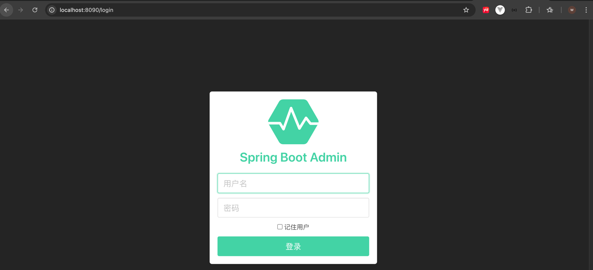

# spring-boot-admin
springboot2 out of the box


# 如何使用

## 服务端启动
环境要求  jdk : 1.8

- 运行程序
直接运行`AcAppMonitorApplication`程序即可

- 查看运行界面，访问 http://localhost:8090



## 客户端注册

客户端是另外一个springboot程序

- 引入依赖
```xml
<dependency>
    <groupId>de.codecentric</groupId>
    <artifactId>spring-boot-admin-starter-client</artifactId>
    <version>2.7.15-SNAPSHOT</version>
</dependency>
```

- 修改关键配置项 `application.yml` 
```yaml
spring:
  application:
    app-client
  boot:
    admin:
      client:
        # 服务端的账号密码，用于认证
        username: root
        password: 123456
        # 监控服务端的访问地址，用户客户端注册
        url: http://localhost:8090
        instance:
          # 客户端访问地址，方便服务端回调
          service-base-url: http://localhost:8080

# ...省略部分配置

# Actuator监控配置
management:
  health:
    mail:
      # close mail service check
      enabled: false
  endpoint:
    health:
      show-details: ALWAYS

  endpoints:
    enabled-by-default: true #关闭监控
    web:
      exposure:
        include: 'health'

```
